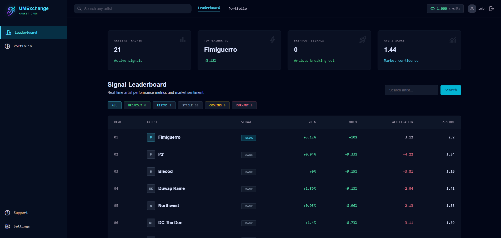
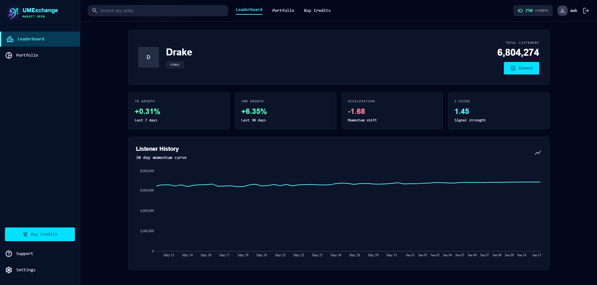
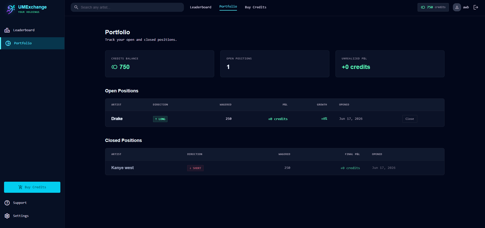

# UM Exchange — Underground Music Exchange

A full-stack data engineering platform that treats underground rap artists like financial assets. Live streaming data is pulled into a quant-style pipeline that computes momentum indicators, classifies artists into market signals, and lets users open simulated LONG/SHORT positions on whether an artist's listener base will rise or fall.





**Live demo:** [music-stock-exchange.netlify.app](https://music-stock-exchange.netlify.app)
**API docs:** [underground-music-stock-exchange.onrender.com/docs](https://underground-music-stock-exchange.onrender.com/docs)

---

## Why this project

Most portfolio projects are CRUD apps. This one applies real quantitative finance concepts — momentum, acceleration, z-scores, long/short positions — to a domain (underground rap) with genuinely chaotic, fast-moving data. It demonstrates data engineering, time-series feature engineering, backend API design, authentication, and a polished frontend, all wired into one coherent product.

## Core concept

Artists are treated as assets. Listener counts and play counts are price. The system tracks how those numbers move over time and classifies each artist into one of five signals:

| Signal | Meaning |
|---|---|
| `BREAKOUT` | Strong, accelerating growth |
| `RISING` | Steady positive growth |
| `STABLE` | Flat, low volatility |
| `COOLING` | Declining momentum |
| `DORMANT` | Long-term decline, low activity |

Users can register, receive starting credits, and open simulated positions betting on an artist's future listener growth (LONG) or decline (SHORT). Positions are settled against real Last.fm data.

## Architecture

```
Last.fm API → Ingestion (Python) → PostgreSQL (Supabase) → Feature Engine (Pandas)
            → Signal Classifier → FastAPI → React Frontend
```

A scheduled job (Windows Task Scheduler in dev, cron-equivalent in production) pulls fresh listener/playcount data for every tracked artist once every 24 hours, building up real historical time-series data over time.

## Tech stack

**Backend**
- FastAPI — REST API layer
- PostgreSQL (Supabase) — time-series data storage
- Pandas / NumPy — feature engineering
- JWT (python-jose) + bcrypt (passlib) — authentication
- psycopg2 — database driver

**Frontend**
- React (Vite)
- Tailwind CSS
- Recharts — listener history visualization
- Axios

**Infrastructure**
- Render — API hosting
- Netlify — frontend hosting
- Supabase — managed Postgres with connection pooling
- Windows Task Scheduler — automated daily ingestion

## Features

- Live data ingestion from the Last.fm API, scheduled daily
- Time-series feature engineering: 7-day and 30-day growth, momentum acceleration, z-score
- Rule-based signal classification engine
- Ranked leaderboard with filtering by signal type
- Per-artist detail view with historical listener chart
- Real-time artist search — adds any artist on demand and seeds their history
- User authentication (JWT) with registration, login, and session expiry handling
- Credits-based virtual investing system — open LONG or SHORT positions on any tracked artist
- Live portfolio with unrealized P&L calculated against real listener data
- Responsive dark "trading terminal" UI

## Feature engineering details

For each artist, the system computes:

- **7-day / 30-day listener growth** — percentage change in listener count over the period
- **Acceleration** — whether growth in the second half of a window is faster or slower than the first half, capturing momentum shifts a simple growth rate would miss
- **Z-score** — how far current listeners deviate from the 30-day mean, in standard deviations, used as a measure of signal strength/confidence

These feed into a priority-ordered classifier that assigns one of five signals, and the leaderboard ranks first by signal tier, then by 7-day growth within each tier.

## Local setup

### Backend

```bash
git clone https://github.com/your-username/music-quant.git
cd music-quant
python -m venv venv
venv\Scripts\activate          # Windows
pip install -r requirements.txt
```

Create a `.env` file in the project root:

```env
LASTFM_API_KEY=your_lastfm_api_key
SUPABASE_DATABASE_URL=your_supabase_connection_string
SECRET_KEY=your_jwt_secret_key
DB_HOST=localhost
DB_PORT=5432
DB_NAME=musicquant
DB_USER=postgres
DB_PASSWORD=your_local_postgres_password
```

Set up the database:

```bash
python storage/schema.py
python storage/auth_schema.py
python storage/seed_history.py
```

Run the API:

```bash
uvicorn api.main:app --reload
```

### Frontend

```bash
cd frontend
npm install
```

Create `frontend/.env`:

```env
VITE_API_URL=http://localhost:8000
```

Run the dev server:

```bash
npm run dev
```

### Automated ingestion

`run_ingest.bat` runs `ingestion/ingest.py` to pull fresh data for every tracked artist. Schedule it daily with Windows Task Scheduler (or cron/a serverless scheduled function in production).

## API reference

| Endpoint | Method | Description |
|---|---|---|
| `/leaderboard` | GET | Ranked list of all tracked artists with signals and metrics |
| `/artist/{id}/history` | GET | Listener history time series for charting |
| `/artist/{id}/signal` | GET | Current signal and feature values for one artist |
| `/search?name=` | GET | Find an artist on Last.fm, add to tracking, seed history |
| `/register` | POST | Create a user account |
| `/login` | POST | Authenticate and receive a JWT |
| `/positions/open` | POST | Open a LONG or SHORT position (auth required) |
| `/positions/close/{id}` | POST | Close a position and settle P&L (auth required) |
| `/portfolio` | GET | Current credits balance and all positions (auth required) |

Full interactive docs available at `/docs` (Swagger UI).

## Database schema

```
artists           — id, name, genres, created_at
artist_metrics     — id, artist_id, listeners, playcount, recorded_at
users              — id, username, email, password_hash, credits, created_at
positions          — id, user_id, artist_id, direction, credits_wagered,
                      listener_count_at_open, status, pnl, opened_at, closed_at
```

## Roadmap

- [ ] Stripe integration for purchasing credit bundles
- [ ] Backtesting framework to validate signal accuracy against historical outcomes
- [ ] Migrate scheduled ingestion to a cloud-native scheduler (e.g. Render cron jobs)
- [ ] Admin dashboard for managing tracked artists
- [ ] Push notifications for signal changes on positions a user holds

## Author

Built by Al, a Computer Science student at Montclair State University, as a portfolio project demonstrating full-stack data engineering, applied quantitative methods, and product thinking.